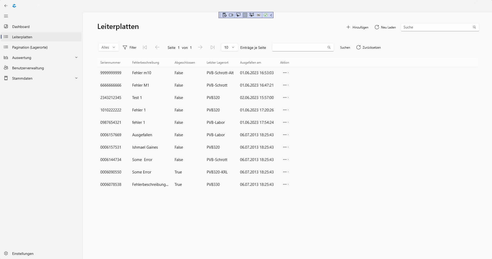
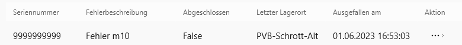
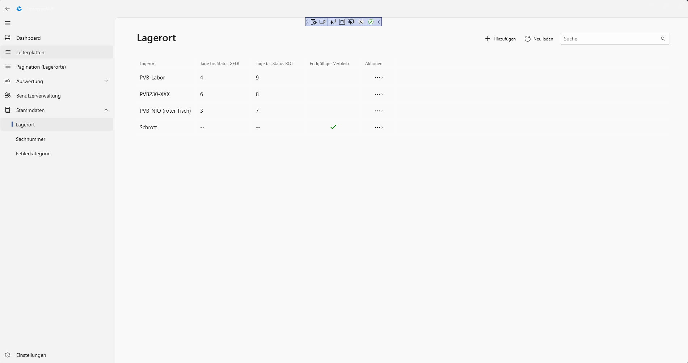
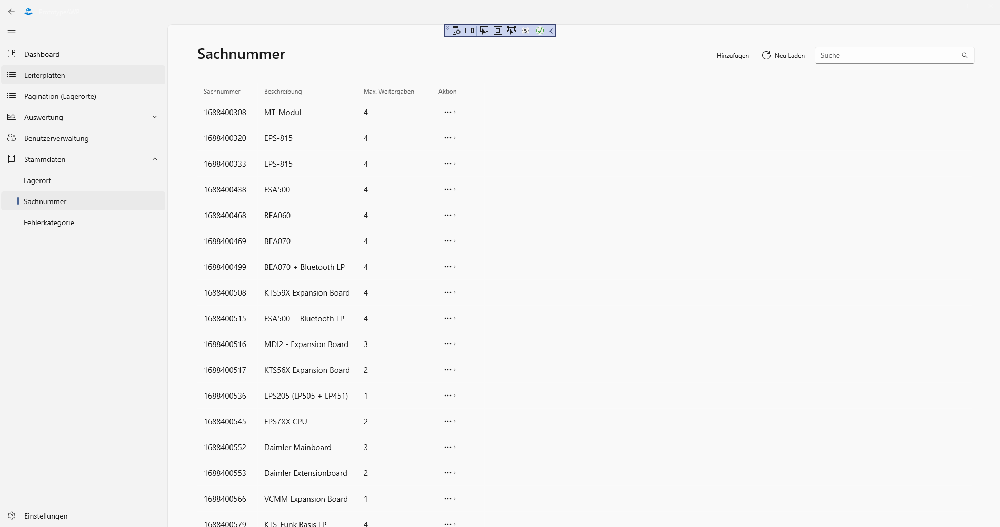

*Recommended Markdown Viewer: [Markdown Editor](https://marketplace.visualstudio.com/items?itemName=MadsKristensen.MarkdownEditor2)*

# Bosch AWP
Dieses Projekt entstand aus Zusammenarbeit von der [Hochschule für Technik und Wirtschaft Karlsruhe](https://www.h-ka.de/) und [Bosch](https://www.bosch.de/). Es handelt sich um eine Studienleistung von Samer Fares, Nicolas Kaasch, Tobias Kühn, Theo Pötzl, Lisa Reichenbacher und Daniel Schleicher.

Es ist eine Leiterplattenverwaltung für den [Boschstandort Plochingen](https://www.bosch.de/unser-unternehmen/bosch-in-deutschland/plochingen/). 

## Inhaltsverzeichnis
- [Setup](#Setup)
    - [Datenbank](#Datenbank)
    - [Useranmeldung](#Useranmeldung)
    - [Testdaten einfügen](#Testdaten_einfügen)
    - [Starten der Applikation](#Starten_der_Applikation)
- [Betriebsanleitung](#Betriebsanleitung)
    - [Leiterplatten](#Leiterplatten)
        - [Leiterplatten hinzufügen](#Leiterplatten_hinzufügen)
        - [Leiterplatten weitergeben](#Leiterplatten_weitergeben)
        - [Leiterplatten bearbeiten](#Leiterplatten_bearbeiten)
        - [Leiterplatten suchen](#Leiterplatten_suchen)
        - [Leiterplatten filtern](#Leiterplatten_filtern)
    - [Lagerorte](#Lagerorte)
        - [Einzelansicht](#Einzelansicht)
        - [Weitergabe](#Weitergabe)
        - [Bearbeiten](#Bearbeiten)
        - [Hunzufügen](#Hinzufügen)
    - [Auswertung](#Auswertung)
    - [Benutzerverwaltung](#Benutzerverwaltung)
    - [Stammdaten](#Stammdaten)
        - [Lagerort](#Lagerort)
            - [Lagerort Hinzufügen](#Lagerort_Hinzufügen)
            - [Lagerort Bearbeiten](#Lagerort_Bearbeiten)
        - [Sachnummer](#Sachnummer)
            - [Sachnummer Hinzufügen](#Sachnummer_Hinzufügen)
            - [Sachnummer Bearbeiten](#Sachnummer_Bearbeiten)
        - [Fehlerkategorie](#Fehlerkategorie)
            - [Fehlerkategorie Hinzufügen](#Fehlerkategorie_Hinzufügen)
            - [Fehlerkategorie Bearbeiten](#Fehlerkategorie_Bearbeiten)
    - [Drucken](#Drucken)
    - [Einstellungen](#Einstellungen)

## Setup

Für eine Nutzung des Systems werden einige Schritte benötigt. Diese werden sich über den Verlauf der Meilensteine noch kürzen.

Stand 2. Meilenstein.

### Datenbank

Zum Aufsetzen der MS SQL 2019 Datenbank benötigt man eine [Powershell](https://learn.microsoft.com/de-de/powershell/scripting/install/installing-powershell-on-windows?view=powershell-7.3) und [Docker](https://www.docker.com/products/docker-desktop/).

Zuerst ist der Download des aktuellem Image nötig. Dazu gibt man den folgenden Befehl in eine [Powershell](https://learn.microsoft.com/de-de/powershell/scripting/install/installing-powershell-on-windows?view=powershell-7.3) ein.

>docker pull mcr.microsoft.com/mssql/server:2019-latest

Im Anschluss setzt man ein Passwort. Dieses Passwort muss folgenden Richtlinien genügen: Großbuchstaben, Kleinbuchstaben, Grundzahlen (0–9) und Symbole.

>docker run -e "ACCEPT_EULA=Y" -e "MSSQL_SA_PASSWORD=<meinPasswort>" -p 1433:1433 --name sql1 --hostname sql1 -d mcr.microsoft.com/mssql/server:2019-latest

Das &lt;meinPasswort> sollte durch ein eigenes Passwort ersetzt werden.

In den Dateien 
>/Entityframework_MSSQL_Test/DataAccess/UserContext.cs Zeile 21

und

>Entityframework_MSSQL_Test/Models/appsettings.json Zeile 25

muss das entsprechende Passwort gesetzt werden.

Nun sollte in sicher gestellt werden, dass der Container auf [Docker](https://www.docker.com/products/docker-desktop/) läuft. Dafür öffnet man Docker Desktop und klickt auf den Reiter Container.
Der Container "sql1" sollte laufen. Das ist am Status "running" erkennbar.

Zurück in der Powershell wird dann in die Befehlszeile des Servers gewechselt.

>docker exec -it sql1 "bash"

In dieser wird anschließend mit dem folgenden Befehl angemeldet.

>/opt/mssql-tools/bin/sqlcmd -S localhost -U SA -P "<meinPasswort>"

Nun kann man die Datenbank erstellen.

>CREATE DATABASE TestDB;
>
>GO

Anschließend kann man durch zweimaliges Eingeben von 

>exit

den Bereich wieder verlassen.

### Useranmeldung

Zuerst öffnet man den Projektmappen-Explorer (STRG+ALT+L). Hier sucht man unter App.Core den Ordern Services und darunter die Datei AuthenticationService.cs.

Diese Datei öffnet man mit einem Doppelklick. In dieser Datei sucht man nach der Funktion authenticate(). Diese sollte in Zeile 16 liegen.

Nun kann man durch klicken am linken Rand einen Breakpoint nach dem Aufruf von "var adUsername = Environment.UserName;" setzen.

Wenn man nun die Applikation startet wird diese hier stoppen. In den Variablen findet man nun den Wert von AdUsername.

Wenn noch keine Verbindung zur Datenbank über den Server-Explorer hergestellt wurde, hilft diese [Dokumentation](https://learn.microsoft.com/de-de/visualstudio/data-tools/add-new-connections?view=vs-2022) dazu.

Über den oben beschrieben Server - Explorer (STRG+ALT+S) nimmt man Verbindung mit DB-Server auf. Mit einem Rechtsklick auf den Server öffnet man das Kontextmenü. Hier wählt man "Neue Abfrage aus" und gibt die folgende Transaktion ab.

>BEGIN TRANSACTION;\
>BEGIN TRY\
>INSERT INTO [dbo].[Users] ([Name], [AdUsername], [CreatedDate], [DeletedDate])\
>VALUES ('BliebigerName', 'HIER_DEIN_ADUSERNAME', GETDATE(), '01-01-1999');\
>COMMIT;\
>END TRY\
>BEGIN CATCH\
>ROLLBACK;\
>END CATCH;

### Testdaten einfügen
Wenn noch keine Verbindung zur Datenbank über den Server-Explorer hergestellt wurde, hilft diese [Dokumentation](https://learn.microsoft.com/de-de/visualstudio/data-tools/add-new-connections?view=vs-2022) dazu.

Über den oben beschrieben Server - Explorer (STRG+ALT+S) nimmt man Verbindung mit DB-Server auf und gibt die folgenden Befehle ab.

Für die Lagerorte
>INSERT INTO [dbo].[StorageLocations] ([StorageName], [DwellTimeYellow], [DwellTimeRed], [CreatedDate], [DeletedDate], [IsFinalDestination])\
>VALUES\
>    ('PVB-Labor', '4', '9', GETDATE(), '01-01-2002', 0),\
>    ('PVB-Schrott', '--', '--', GETDATE(), '01-01-2002', 1),\
>    ('PVB230-XXX', '6', '8', GETDATE(), '01-01-2002', 0),\
>    ('PVB320-KRL', '4', '13', GETDATE(), '01-01-2002', 0),\
>    ('PVB330-XXX', '12', '20', GETDATE(), '01-01-2002', 0),\
>    ('PVB-NIO (roter Tisch)', '3', '7', GETDATE(), '01-01-2002', 0);

Für die Sachnummern

>INSERT INTO [dbo].[PcbTypes] ([PcbPartNumber], [MaxTransfer], [CreatedDate], [DeletedDate], [Description])\
>VALUES\
>('1688400308', 4, GETDATE(), '01-01-2002', N'MT-Modul'),\
>('1688400320', 4, GETDATE(), '01-01-2002', N'EPS-815'),\
>('1688400333', 4, GETDATE(), '01-01-2002', N'EPS-815'),\
>('1688400438', 4, GETDATE(), '01-01-2002', N'FSA500'),\
>('1688400468', 4, GETDATE(), '01-01-2002', N'BEA060'),\
>('1688400469', 4, GETDATE(), '01-01-2002', N'BEA070'),\
>('1688400499', 4, GETDATE(), '01-01-2002', N'BEA070 + Bluetooth LP'),\
>('1688400508', 4, GETDATE(), '01-01-2002', N'KTS59X Expansion Board'),\
>('1688400515', 4, GETDATE(), '01-01-2002', N'FSA500 + Bluetooth LP'),\
>('1688400516', 3, GETDATE(), '01-01-2002', N'MDI2 - Expansion Board'),\
>('1688400517', 2, GETDATE(), '01-01-2002', N'KTS56X Expansion Board'),\
>('1688400536', 1, GETDATE(), '01-01-2002', N'EPS205 (LP505 + LP451)'),\
>('1688400545', 2, GETDATE(), '01-01-2002', N'EPS7XX CPU'),\
>('1688400552', 3, GETDATE(), '01-01-2002', N'Daimler Mainboard'),\
>('1688400553', 2, GETDATE(), '01-01-2002', N'Daimler Extensionboard'),\
>('1688400566', 1, GETDATE(), '01-01-2002', N'VCMM Expansion Board'),\
>('1688400579', 4, GETDATE(), '01-01-2002', N'KTS-Funk Basis LP'),\
>('1688400580', 2, GETDATE(), '01-01-2002', N'VCMM Mainboard'),\
>('1688400586', 3, GETDATE(), '01-01-2002', N'JLR'),\
>('1688400593', 2, GETDATE(), '01-01-2002', N'DCI700'),\
>('1688400598', 1, GETDATE(), '01-01-2002', N'KTS250 Board'),\
>('1688400627', 2, GETDATE(), '01-01-2002', N'VCI-Renault ohne Display'),\
>('1688400628', 3, GETDATE(), '01-01-2002', N'VCI-Renault mit Display'),\
>('1688400643', 3, GETDATE(), '01-01-2002', N'BEA030 Modul'),\
>('1688400651', 4, GETDATE(), '01-01-2002', N'GVCI China'),\
>('1688400656', 2, GETDATE(), '01-01-2002', N'MDI2 Mainbaord (neu)'),\
>('1688400664', 3, GETDATE(), '01-01-2002', N'IVS- Europa'),\
>('1688400671', 2, GETDATE(), '01-01-2002', N'MDI2 Mainboard (Variante GAC)'),\
>('1688403383', 3, GETDATE(), '01-01-2002', N'KTS-NG Mainboard unprogrammiert'),\
>('F00K108925', 1, GETDATE(), '01-01-2002', N'Vetronix Mainboard'),\
>('F00K108927', 2, GETDATE(), '01-01-2002', N'Vetronix Expansionboard');

## Starten der Applikation
Zum Starten der Applikation ist sicherzustellen, dass derContainer auf [docker](https://www.docker.com/products/docker-desktop/) läuft. Dafür öffnet man Docker Desktop und klickt auf den Reiter Container.
Der Container "sql1" sollte laufen. Das ist am Status "running" erkennbar.

Nun kann man in Visual Studio mit "F5" die Applikation starten.

## Betriebsanleitung

Im Folgenden werden die möglichen Anwendungsfälle beschrieben. Hier können Sie die Handhabung der Anwendung nachlesen. Bei Fragen melden Sie sich bei ihrem Vorgesetzen.

### Leiterplatten

In diesem Abschnitt werden alle Funktionalitäten unter dem Reiter Leiterplatte beschrieben

Für den Fall, dass in der Bearbeitung etwas schief gehen sollte, kann man den letzten Schritt mit der Zurücksetzen Funktion die letzte Transaktion rückgängig machen.

Ein Filter hilft die Ansicht so anzupassen, dass die nötigen Elemente angezeigt werden.

#### Leiterplatte hinzufügen
Im Rechten oberen Ecke findet sich eine Menüleiste, welche das Icon fürs Hinzufügen enthält. Durch einen Klick öffnet sich eine Maske, in welcher die neue Leiterplatte angelegt werden kann.

Das Datum wird über ein Kalender Pop-up augewählt. Der Benutzername sollte automatisch ausgefüllt werden. Wenn in der Anwendung nicht der eigene Name hinterlegt ist, sollte aus Sicherheitsgründen der Vorgesetze informiert werden.
Dann kann eine Sachnummer gewählt werden. Die Seriennummer wird in das Feld der Seriennummer eingetragen.
Unter Feherbeschreibung kann dann der Fehler gewählt werden. Nun muss nur noch der Lagerort gewählt werden.

Zu beachten sind hier folgende Restriktionen:
* Das Datum sollte nicht in der Zukunft liegen.
* Die Seriennummer & Sachnummer sind eine zehnstellige Zahl.

Wenn der gesuchte Lagerort nicht zu finden ist, kann dieser in der Stammdatenverwaltung hinzugefügt werden.

#### Leiterplatte weitergeben
Über das Aktionsmenü und den Bereich Weitergabe kann eine Leiterplatte weitergegeben werden.
In der sich öffnenden Maske kann man nun einen neuen Ort für die ausgewählte Leiterplatte wählen und eine Anmerkung hinzufügen.
Über den Knopf "Weitergeben" schließt man den Prozess erfolgreich ab.
#### Leiterplatte bearbeiten
Über das Aktionsfeld am rechten Ende jedes Eintrags in der Tabelle kann man neben 

Im Anschluss öffnet sich ein Fenster, welches die aktuellen Attribute der Leiterplatte anzeigen. Diese können in den jeweiligen Textfeldern bearbeitet werden.
Beachte bei der Bearbeitung gelten die gleichen Restriktionen wie beim Erstellen:
* Das Datum sollte nicht in der Zukunft liegen.
* Die Seriennummer & Sachnummer sind eine zehnstellige Zahl.
* 
#### Leiterplatte suchen
Mit der Suchfunktion lassen sich einfach Leiterplatten suchen. Gesucht werden kann nach der Seriennummer.

#### Leiterplatten filtern
Hier kann die Ansicht angepasst werden, damit die wichtigsten Elemente oben angebracht werden.
### Lagerorte
In dieser Übersicht kann man die jeweiligen Lagerorte und die daran befindende Leiterplatten sehen.
Über die Filterfunktion lässt sich die Ansicht entsprechend anpassen.  Im Aktionsmenü kann von der Leiterplatte eine Detailansicht angezeigt werden.
Zusätzlich kann man hier die Leiterplatte weitergeben, bearbeiten oder löschen. Über das Menü rechts oben kann die Ansicht aktualisiert werden, nach Leiterplatten gesucht oder neue hinzugefügt werden.

#### Einzelansicht
Die Einzelansicht enthält alle Informationen zu der gewählten Leiterplatte. In der rechten oberen Ecke hat man einen Überblick über die Interkationsmöglichkeiten: Drucken, Bearbeiten und Löschen.
Nach den Informationen zu Sachnummer und dem Ausfallsdatum gibt es die Möglichkeit über den Einschränkung hinzufügen Button Einschränkungen aufzunehmen.
Dann lässt sich noch die Umlaufhistorie der Leiterplatte betrachen. Per Klick öffnet sich ein Bereich mit weiteren Informationen. Durch erneutes Klicken wird dieser wieder minimiert. Hier kann man auch einsehen, wer welche Schritte unternommen hat.

#### Weitergabe
Über das Aktionsmenü und den Bereich Weitergabe kann eine Leiterplatte weitergegeben werden.
In der sich öffnenden Maske kann man nun einen neuen Ort für die ausgewählte Leiterplatte wählen und eine Anmerkung hinzufügen.
Über den Knopf "Weitergeben" schließt man den Prozess erfolgreich ab.

#### Bearbeiten
Im Anschluss öffnet sich ein Fenster, welches die aktuellen Attribute der Leiterplatte anzeigen. Diese können in den jeweiligen Textfeldern bearbeitet werden.
Über den Speicher Button wird die Änderung gespeichert. Mittels des Abbrechen Button werden ungespeicherte Änderungen verworfen und das Fenster geschlossen
Beachte bei der Bearbeitung gelten die gleichen Restriktionen wie beim Erstellen:
* Das Datum sollte nicht in der Zukunft liegen.
* Die Seriennummer & Sachnummer sind eine zehnstellige Zahl.

#### Hinzufügen
Zum Hinzufügen einer neunen Leiterplatte wird zuerst das Datum über ein Kalender Pop-up augewählt. Der Benutzername sollte automatisch ausgefüllt werden. Wenn in der Anwendung nicht der eigene Name hinterlegt ist, sollte aus Sicherheitsgründen der Vorgesetze informiert werden.
Dann kann eine Sachnummer gewählt werden. Die Seriennummer wird in das Feld der Seriennummer eingetragen.
Unter Feherbeschreibung kann dann der Fehler gewählt werden. Nun muss nur noch der Lagerort gewählt werden.

Zu beachten sind hier folgende Restriktionen:
* Das Datum sollte nicht in der Zukunft liegen.
* Die Seriennummer & Sachnummer sind eine zehnstellige Zahl.

Wenn der gesuchte Lagerort nicht zu finden ist, kann dieser in der Stammdatenverwaltung hinzugefügt werden.

### Auswertung
work in progress

### Benutzerverwaltung
work in progress

### Stammdaten
In der Stammdatenübersicht können die Daten eingesehen werden, mit denen aktuell gearbeitet werden. Hier können zusätzlich neue Sachnummern oder Fehlerkategorien erstellt oder angepasst werden.

#### Lagerort
In diesem Untermenü finden sich alle Lagerorte mit ihren maximalen Lagerzeiten, bis das gelagerte Element in ihrem Status auf gelb oder rot wechselt.
Zusätzlich erkennt man, ob es sich um einen endgültigen Verbleib handelt.

##### Lagerort Hinzufügen
Über das Menü in der rechten oberen Ecke findet sich die Möglichkeit neue Lagerorte hinzuzufügen.

Beim Erstellen eines neuen Lagerortes müssen folgende Restriktionen beachtet werden:
* Die Übergangszeiten auf den Status gelb oder rot müssen ganze positive Zahlen sein.
* Der Lagerort erlaubt eine Kombination aus Ziffern, Buchstaben und Sonderzeichen.
* Übergangszeiten für einen Lagerort mit endgültigem  Verbleib anzulegen, ergibt nur bedingt Sinn.

##### Lagerort Bearbeiten
In der Bearbeitungsübersicht können die Daten zum aktuellen Lagerort betrachtet und gegebenenfalls angepasst werden.
Beim Ändern eines Lagerortes müssen folgende Restriktionen beachtet werden:
* Die Übergangszeiten auf den Status gelb oder rot müssen ganze positive Zahlen sein.
* Der Lagerort erlaubt eine Kombination aus Ziffern, Buchstaben und Sonderzeichen.
* Übergangszeiten für einen Lagerort mit endgültigem  Verbleib anzulegen, ergibt nur bedingt Sinn.

#### Sachnummer
Auf der Übersichtseite der aktuellen Sachnummern findet sich rechts oben die Möglichkeite eine neue Sachnummer hinzuzufügen.
Daneben findet sich ein Suchfeld nach Sachnummern.

In der Tabelle findet sich zu den Sachnummern eine Beschreibung und die Anzahl der maximalen Weitergaben.
Im Untermenü Aktion findet man durchs Daraufklicken die Möglichkeit den gewählten Sachnummer Datensatz zu bearbeiten oder zu löschen.

##### Sachnummer Hinzufügen
Über den Hinzufügen Button kommt man von der Übersicht auf die Erstellungsseite für Sachnummern.
Zuerst muss eine 10-stelltige Sachnummer eingegeben werden. Dann eine Bezeichung in das Textfeld darunter.
Under Maximale Anzahl der Weitergaben eine Zahl zwischen 0 und 100. Über den Hinzufügen Button wird die Sachnummer gespeichert. Mit Abbrechen wird der Vorgang abgebrochen.

Folgende Restriktionen sind zu beachten:
* Sachnummer besteht aus 10 Ziffern.
* Das Maximum der Weitergaben ist 100.
* Der Wert der Weitergaben ist eine positive und ganze Zahl.

##### Sachnummer Bearbeiten

In der Bearbeitungssicht können die aktuellen Daten zur Sachnummer angeschaut und gegebenenfalls bearbeitet werden.
Folgende Restriktionen sind zu beachten:
* Sachnummer besteht aus 10 Ziffern.
* Das Maximum der Weitergaben ist 100.
* Der Wert der Weitergaben ist eine positive und ganze Zahl.

#### Fehlerkategorie
In der Fehlerkatogrie können die aktuellen Kategorien eingesehen werden. Mit der Hinzufügenfunktion oben rechts werden neue Fehlerkategorien erstellt.
Über das Aktionsmenü am rechten Ende eines jeden Fehlerkategorieneintrag kann der jeweilige Eintrag bearbeitet oder gelöscht werden.
##### Fehlerkategorie Hinzufügen
Hier kann eine neue Fehlerkategorie erstellt werden. Unter Bezeichnung eingeben kann in das Textfeld Bezeichnung ein Name für die neue Fehlerkategorie gewählt werden.
Die Bezeichnung ist zweiteilig. Einem Buchstabe und einer bis zu dreistelligen Ziffernkennung.

Über Abbrechen kann die Funktion beendet werden.
##### Fehlerkategorie Bearbeiten
Hier wird die aktuelle Fehlerkategorie mit ihren Eigenschaft angezeigt. Durch Klicken in das jeweilige Textfeld können die jeweiligen Eigenschaften angepasst werden.
Eine Änderung unterliegt den gleichen Restriktionen wie eine Erstellung.

### Drucken
Die Druckfunktion findet sich im Aktionsmenü unter der Lagerortübersicht. Zum Drucken geht man also auf den Reiter Lagerort.
Hier kann man dann mittels Suche nach der Leiterplatte (z.B. über die Seriennummer) suchen. Wenn diese nun anzeigt wird, wählt man am rechten Ende des Eintrages das Aktionsmenü.
Hier findet sich das Druckmenü. Dieses Öffnet die bekannte Windows-Druck Maske.

### Einstellungen
Links unten kann man über die Einstellungsfunktion in das Einstellungsfenster wechseln.

Hier kann man zwischen einem dunklen oder hellen Theming für die Anwendung per Klick wechseln.
Zusätzlich gibt es die Möglichkeit eine Standardform (default) auszuwählen.

